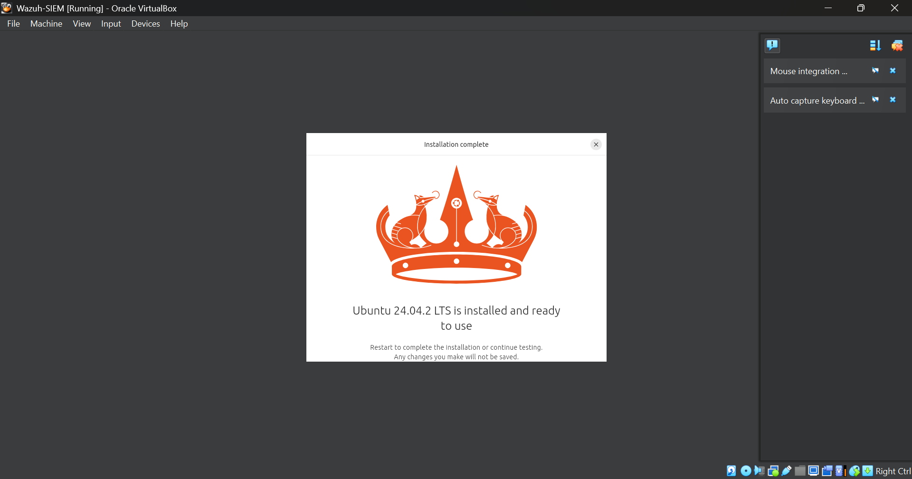
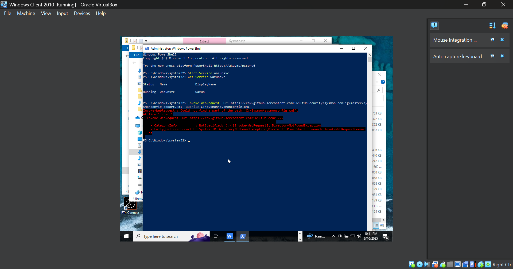
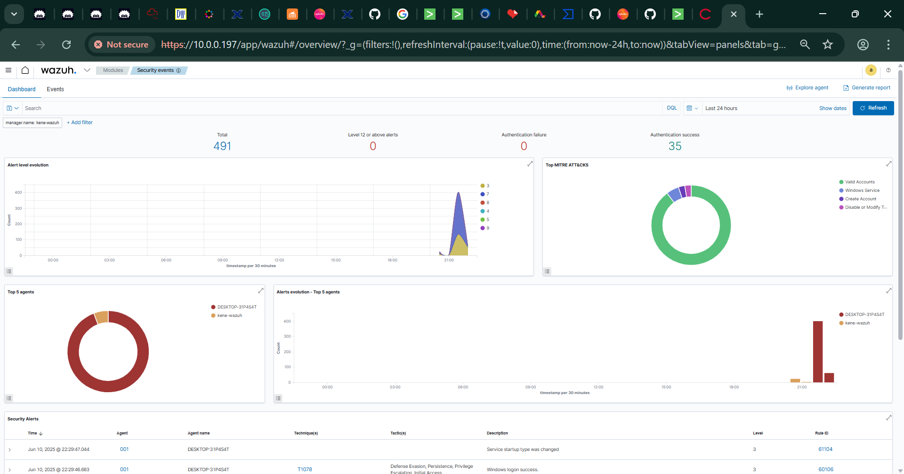
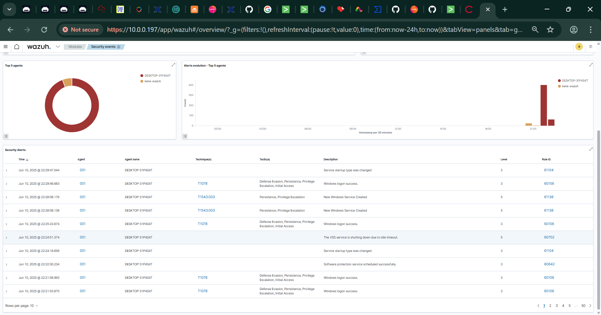

# 🛡️ Blue Team SIEM Lab: Wazuh + Sysmon for Detection & Monitoring

This project simulates a blue team monitoring environment using **Wazuh** as the SIEM and **Sysmon** for endpoint telemetry. It includes a full installation walkthrough, agent deployment, and real-time threat detection demonstration in a lab environment.

---

## 🧪 Lab Overview

| Component      | Role                              |
|----------------|-----------------------------------|
| 🐧 Ubuntu 24.04 | Wazuh Manager + Dashboard (SIEM)  |
| 🪟 Windows 10   | Sysmon + Wazuh Agent (Endpoint)   |
| 🔄 VirtualBox   | Isolated testing infrastructure   |

---

## ✅ Objectives Achieved

- ☑️ Installed Wazuh SIEM on Ubuntu 24.04
- ☑️ Deployed Windows 10 endpoint VM
- ☑️ Installed & configured Sysmon with SwiftOnSecurity config
- ☑️ Deployed Wazuh Agent on Windows and linked to Wazuh Manager
- ☑️ Confirmed real-time telemetry & security alerts
- ☑️ Simulated common event types (logons, service changes)

---

## 🖼️ Screenshots

| Step | Image |
|------|-------|
| Wazuh Installation on Ubuntu |  |
| Agent Connected |  |
| Sysmon Configured |  |
| Security Alerts in Dashboard |  |

---

## 🛠️ Tools Used

- [Wazuh 4.7.5](https://wazuh.com)
- [Sysmon](https://docs.microsoft.com/en-us/sysinternals/downloads/sysmon)
- [SwiftOnSecurity Sysmon Config](https://github.com/SwiftOnSecurity/sysmon-config)
- VirtualBox (Guest Isolation)
- PowerShell / Bash

---

## 🚀 How to Reproduce

1. 🐧 Setup Ubuntu VM, install Wazuh Manager + Dashboard
2. 🪟 Setup Windows 10 VM and install:
   - Wazuh Agent
   - Sysmon with SwiftOnSecurity config
3. 🧠 Configure `/var/ossec/etc/ossec.conf` (Manager) and `ossec.conf` (Agent)
4. ✅ Use `Start-Service wazuhsvc` to verify agent is running
5. 📡 Monitor telemetry on Wazuh Dashboard

---

## 📊 Sample Events Observed

- Windows logon success (T1078)
- Service creation/modification (T1543)
- Sysmon telemetry — network/process/file creation

---

## 📚 Learning Outcome

This lab demonstrates how a blue team analyst or SOC operator can use Wazuh and Sysmon to:

- Detect endpoint activity
- Correlate behavior with MITRE ATT&CK techniques
- Monitor in real-time and perform retrospective analysis

---

## 📌 Author

**Kenechukwu Stephen Okeke**  
LinkedIn: [https://www.linkedin.com/in/kenechukwu-okeke/)  
GitHub: [@cyberkensec](https://github.com/cyberkensec)

---

## 📎 License

MIT License
